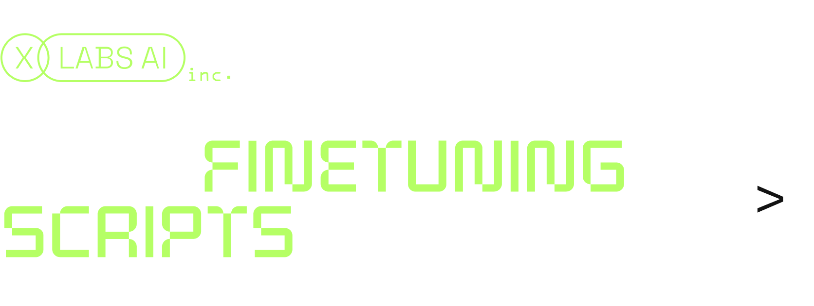

This repository provides training scripts for [Flux model](https://github.com/black-forest-labs/flux) by Black Forest Labs.

[XLabs AI](https://github.com/XLabs-AI) team is happy to publish fune-tuning Flux scripts, including:

- **LoRA** 🔥
- **ControlNet** 🔥

## Models

We trained **Canny ControlNet** and **LoRA** checkpoints for `FLUX.1 [dev]`.<br />
You can download them on HuggingFace:

- [flux-controlnet-canny](https://huggingface.co/XLabs-AI/flux-controlnet-canny)
- [flux-RealismLora](https://huggingface.co/XLabs-AI/flux-RealismLora)

## Requirements

Install our dependencies by running the following command:

```bash
pip3 install requirements.txt
```

## Training scripts

### LoRA (Training)

`<In progress>`

### ControlNet (Training)

`<In progress>`

## Inference scripts

To test our checkpoints, use commands presented below.

### LoRA (Inference)

```bash
python3 demo_lora_inference.py \
    --checkpoint dit.bin —-width 1024 —-height 784 \
    --prompt "A Chicano girl in a suit covered with bold tattoos and holding a vest pistol. Animatrix illustration style, beautiful woman, 25 years old, cool, future fantasy Cool fashion, turquoise & light orange ping curl hair, The backgr"
```

### ControlNet (Inference)

```bash
python3 demo_controlnet_inference.py --checkpoint dit.bin --control_image "input_image.jpg" --prompt "handsome man in the city"
```

## Near Updates

We are working on releasing new ControlNet weight models for Flux: **OpenPose**, **Depth** and more!

Stay tuned with [XLabs AI](https://github.com/XLabs-AI) to see **IP-Adapters** for Flux.
