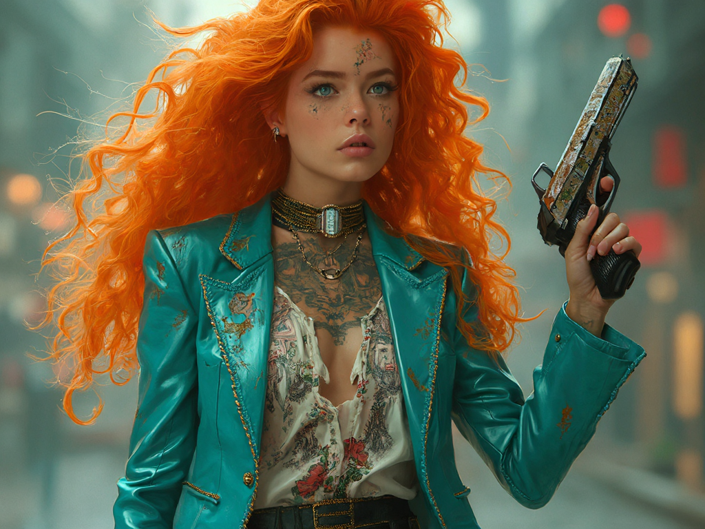
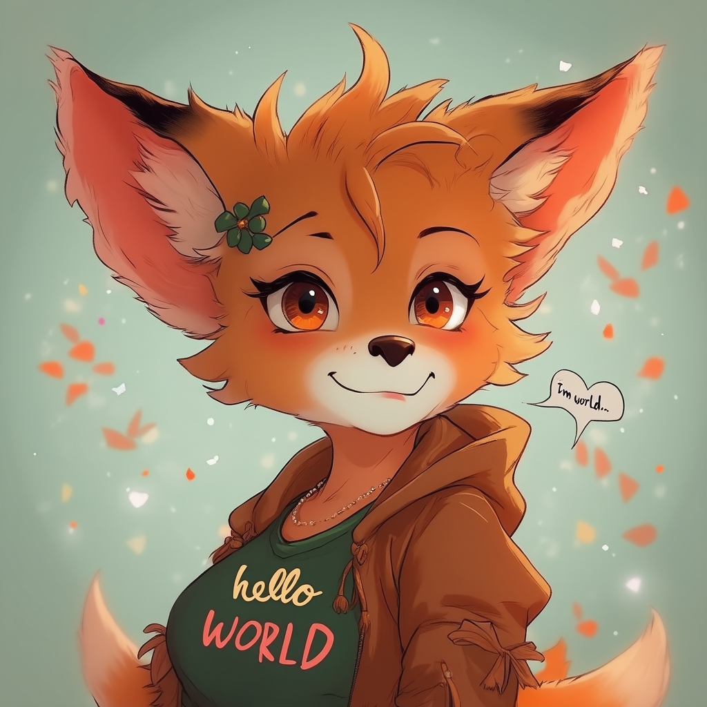
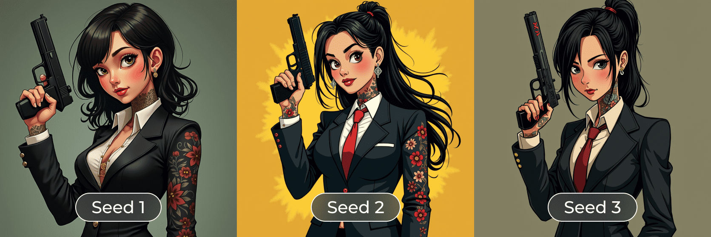

This repository provides training scripts for [Flux model](https://github.com/black-forest-labs/flux) by Black Forest Labs. <br/>
[XLabs AI](https://github.com/XLabs-AI) team is happy to publish fune-tuning Flux scripts, including:

- **LoRA** 🔥
- **ControlNet** 🔥

# Training

We trained LoRA and ControlNet models using [DeepSpeed](https://github.com/microsoft/DeepSpeed)! <br/>
It's available for 1024x1024 resolution!

## Models

We trained **Canny ControlNet**, **Depth ControlNet**, **HED ControlNet** and **LoRA** checkpoints for [`FLUX.1 [dev]`](https://github.com/black-forest-labs/flux) <br/>
You can download them on HuggingFace:

- [flux-controlnet-collections](https://huggingface.co/XLabs-AI/flux-controlnet-collections)
- [flux-controlnet-canny](https://huggingface.co/XLabs-AI/flux-controlnet-canny)
- [flux-RealismLora](https://huggingface.co/XLabs-AI/flux-RealismLora)
- [flux-lora-collections](https://huggingface.co/XLabs-AI/flux-lora-collection)
- [flux-furry-lora](https://huggingface.co/XLabs-AI/flux-furry-lora)

### LoRA

```bash
accelerate launch train_flux_lora_deepspeed.py --config "train_configs/test_lora.yaml"
```

### ControlNet

```bash
accelerate launch train_flux_deepspeed_controlnet.py --config "train_configs/test_canny_controlnet.yaml"
```

## Training Dataset

Dataset has the following format for the training process:

```text
├── images/
│    ├── 1.png
│    ├── 1.json
│    ├── 2.png
│    ├── 2.json
│    ├── ...
```

### Example `images/*.json` file

A `.json` file contains "caption" field with a text prompt.

```json
{
    "caption": "A figure stands in a misty landscape, wearing a mask with antlers and dark, embellished attire, exuding mystery and otherworldlines"
}
```

## Inference

To test our checkpoints, use commands presented below.

### LoRA

prompt: "A girl in a suit covered with bold tattoos and holding a vest pistol, beautiful woman, 25 years old, cool, future fantasy, turquoise & light orange ping curl hair"

prompt: "A handsome man in a suit, 25 years old, cool, futuristic"

```bash
python3 main.py \
 --prompt "Female furry Pixie with text 'hello world'" \
 --lora_repo_id XLabs-AI/flux-furry-lora --lora_name furry_lora.safetensors --device cuda --offload --use_lora \
 --model_type flux-dev-fp8 --width 1024 --height 1024 \
 --timestep_to_start_cfg 1 --num_steps 25 --true_gs 3.5 --guidance 4

```



```bash
python3 main.py \
--prompt "A cute corgi lives in a house made out of sushi, anime" \
--lora_repo_id XLabs-AI/flux-lora-collection --lora_name anime_lora.safetensors \
--device cuda --offload --use_lora --model_type flux-dev-fp8 --width 1024 --height 1024

```


```bash
python3 main.py \
    --use_lora --lora_weight 0.7 \
    --width 1024 --height 768 \
    --lora_repo_id XLabs-AI/flux-lora-collection --lora_name realism_lora.safetensors \
    --guidance 4 \
    --prompt "contrast play photography of a black female wearing white suit and albino asian geisha female wearing black suit, solid background, avant garde, high fashion"
```


## Canny ControlNet
```bash
python3 main.py \
 --prompt "a viking man with white hair looking, cinematic, MM full HD" \
 --image input_image_canny.jpg \
 --control_type canny \
 --repo_id XLabs-AI/flux-controlnet-collections --name flux-canny-controlnet.safetensors --device cuda --use_controlnet \
 --model_type flux-dev --width 768 --height 768 \
 --timestep_to_start_cfg 1 --num_steps 25 --true_gs 3.5 --guidance 4

```


## Depth ControlNet
```bash
python3 main.py \
 --prompt "Photo of the bold man with beard and laptop, full hd, cinematic photo" \
 --image input_image_depth1.jpg \
 --control_type depth \
 --repo_id XLabs-AI/flux-controlnet-collections --name flux-depth-controlnet.safetensors --device cuda --use_controlnet \
 --model_type flux-dev --width 1024 --height 1024 \
 --timestep_to_start_cfg 1 --num_steps 25 --true_gs 3.5 --guidance 4

```


```bash
python3 main.py \
 --prompt "photo of handsome fluffy black dog standing on a forest path, full hd, cinematic photo" \
 --image input_image_depth2.jpg \
 --control_type depth \
 --repo_id XLabs-AI/flux-controlnet-collections --name flux-depth-controlnet.safetensors --device cuda --use_controlnet \
 --model_type flux-dev --width 1024 --height 1024 \
 --timestep_to_start_cfg 1 --num_steps 25 --true_gs 3.5 --guidance 4

```


```bash
python3 main.py \
 --prompt "Photo of japanese village with houses and sakura, full hd, cinematic photo" \
 --image input_image_depth3.webp \
 --control_type depth \
 --repo_id XLabs-AI/flux-controlnet-collections --name flux-depth-controlnet.safetensors --device cuda --use_controlnet \
 --model_type flux-dev --width 1024 --height 1024 \
 --timestep_to_start_cfg 1 --num_steps 25 --true_gs 3.5 --guidance 4

```


## HED ControlNet
```bash
python3 main.py \
 --prompt "2d art of a sitting african rich woman, full hd, cinematic photo" \
 --image input_image_hed1.jpg \
 --control_type hed \
 --repo_id XLabs-AI/flux-controlnet-collections --name flux-hed-controlnet.safetensors --device cuda --use_controlnet \
 --model_type flux-dev --width 768 --height 768 \
 --timestep_to_start_cfg 1 --num_steps 25 --true_gs 3.5 --guidance 4

```


```bash
python3 main.py \
 --prompt "anime ghibli style art of a running happy white dog, full hd" \
 --image input_image_hed2.jpg \
 --control_type hed \
 --repo_id XLabs-AI/flux-controlnet-collections --name flux-hed-controlnet.safetensors --device cuda --use_controlnet \
 --model_type flux-dev --width 768 --height 768 \
 --timestep_to_start_cfg 1 --num_steps 25 --true_gs 3.5 --guidance 4

```


## Low memory mode

Use LoRA and Controlnet FP8 version based on [Flux-dev-F8](https://huggingface.co/XLabs-AI/flux-dev-fp8) with `--offload` setting to achieve lower VRAM usage (22 GB) and `--name flux-dev-fp8`:
```bash
python3 main.py \
    --offload --name flux-dev-fp8 \
    --lora_repo_id XLabs-AI/flux-lora-collection --lora_name realism_lora.safetensors \
    --guidance 4 \
    --prompt "A handsome girl in a suit covered with bold tattoos and holding a pistol. Animatrix illustration style, fantasy style, natural photo cinematic"
```


## Requirements

Install our dependencies by running the following command:

```bash
pip3 install -r requirements.txt
```

## Accelerate Configuration Example

```yaml
compute_environment: LOCAL_MACHINE
debug: false
deepspeed_config:
  gradient_accumulation_steps: 2
  gradient_clipping: 1.0
  offload_optimizer_device: none
  offload_param_device: none
  zero3_init_flag: false
  zero_stage: 2
distributed_type: DEEPSPEED
downcast_bf16: 'no'
enable_cpu_affinity: false
machine_rank: 0
main_training_function: main
mixed_precision: bf16
num_machines: 1
num_processes: 8
rdzv_backend: static
same_network: true
tpu_env: []
tpu_use_cluster: false
tpu_use_sudo: false
use_cpu: false

```
## Models Licence

Our models fall under the [FLUX.1 [dev] Non-Commercial License](https://github.com/black-forest-labs/flux/blob/main/model_licenses/LICENSE-FLUX1-dev) <br/> Our training and infer scripts under the Apache 2 License

## Near Updates

We are working on releasing new ControlNet weight models for Flux: **OpenPose**, **Depth** and more! <br/>
Stay tuned with [XLabs AI](https://github.com/XLabs-AI) to see **IP-Adapters** for Flux.


