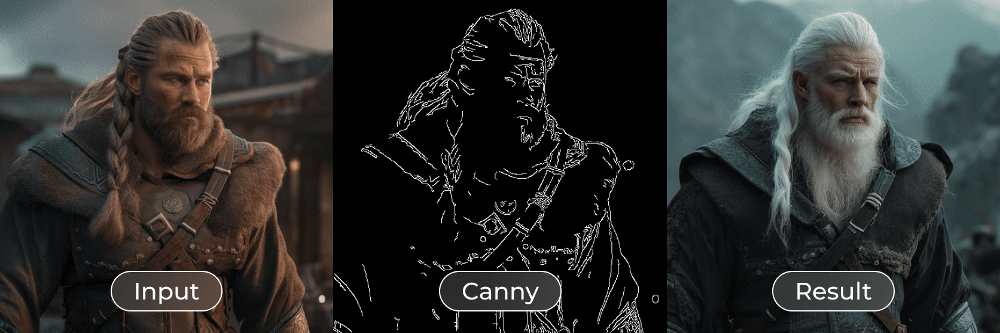

This repository provides training scripts for [Flux model](https://github.com/black-forest-labs/flux) by Black Forest Labs. <br/>
[XLabs AI](https://github.com/XLabs-AI) team is happy to publish fune-tuning Flux scripts, including:

- **LoRA** 🔥
- **ControlNet** 🔥

# Training

We trained LoRA and ControlNet models using [DeepSpeed](https://github.com/microsoft/DeepSpeed)! <br/>
Both of them are trained on 512x512 pictures, 1024x1024 is in progress.

### LoRA

```bash
accelerate launch train_scripts/train_flux_lora_deepspeed.py --config "train_configs/test_lora.yaml"
```

### ControlNet
```bash
accelerate launch train_scripts/train_flux_deepspeed_controlnet.py --config "train_configs/test_canny_controlnet.yaml"
```
## Dataset forman
Folder with images and jsons. Each json have "caption" field.
Example: ["image1.jpg", "image1.json", "image2.jpg", "image2.json"]

## Models

We trained **Canny ControlNet** and **LoRA** checkpoints for [`FLUX.1 [dev]`](https://github.com/black-forest-labs/flux) <br/>
You can download them on HuggingFace:

- [flux-controlnet-canny](https://huggingface.co/XLabs-AI/flux-controlnet-canny)
- [flux-RealismLora](https://huggingface.co/XLabs-AI/flux-RealismLora)

## Inference

To test our checkpoints, use commands presented below.

### LoRA

```bash
python3 demo_lora_inference.py \
    --checkpoint lora.safetensors \
    --prompt "A handsome girl in a suit covered with bold tattoos and holding a pistol. fantasy style, natural photo cinematic"
```


### ControlNet (Canny)

```bash
python3 demo_controlnet_inference.py \
    --checkpoint controlnet.safetensors \
    --control_image "input_image.jpg" \
    --prompt "a bright blue bird in the garden, natural photo cinematic, MM full HD"
```


```bash
python3 demo_controlnet_inference.py \
    --checkpoint controlnet.safetensors \
    --control_image "input_image.jpg" \
    --prompt "a dark evil mysterius house with ghosts, cinematic, MM full HD"
```


```bash
python3 demo_controlnet_inference.py \
    --checkpoint controlnet.safetensors \
    --control_image "input_image.jpg" \
    --prompt "a handsome viking man with white hair, cinematic, MM full HD"
```



```bash
python3 demo_controlnet_inference.py \
    --checkpoint controlnet.safetensors \
    --control_image "input_image.jpg" \
    --prompt "a oil painting woman sitting at chair and smiling, cinematic, MM full HD"
```


## Requirements

Install our dependencies by running the following command:

```bash
pip3 install requirements.txt
```

## Near Updates

We are working on releasing new ControlNet weight models for Flux: **OpenPose**, **Depth** and more! <br/>
Stay tuned with [XLabs AI](https://github.com/XLabs-AI) to see **IP-Adapters** for Flux.


